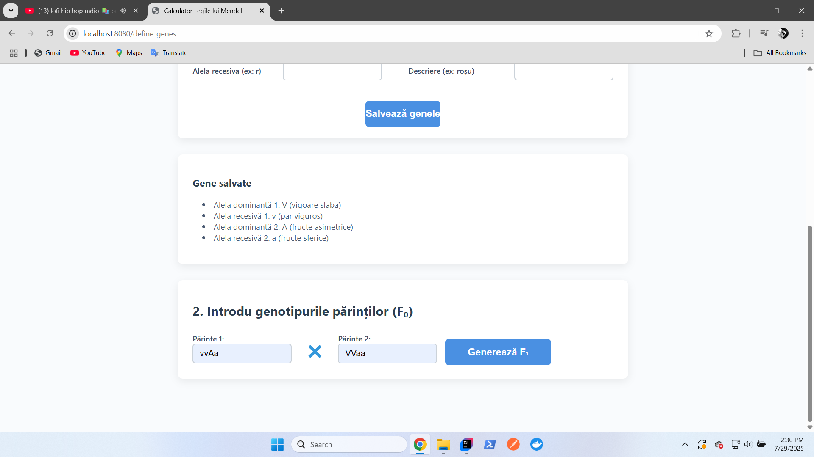
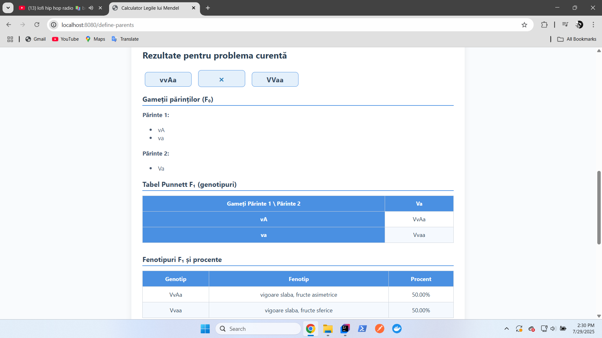

🧬 CalculatorGeneticaMendel 🧬 - Interactive app for simulating Mendelian genetics

🌐 [Youtube presentation for CalculatorGeneticaMendel](https://youtu.be/KZdOgQhQRsE)

CalculatorGeneticaMendel is an interactive web app that helps users simulate Mendelian genetic crosses, generate Punnett squares, and calculate offspring genotype and phenotype probabilities. It’s designed for students and educators to easily explore classic inheritance patterns.

Features

- Interactive web app for simulating Mendelian genetic crosses

- Generates Punnett squares for visualizing gene combinations

- Calculates probabilities of offspring genotypes and phenotypes

- Designed for students and educators in genetics and biology

- User-friendly interface for easy learning and experimentation

Screenshots:

### Landing page
   
   
   

